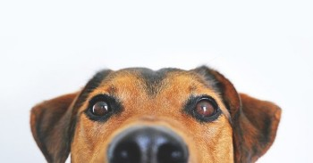

# myProject01
## I miai amici animali
Benvenuti nel **mio progetto** :relaxed:

nel quale vi descriverò i miei tre animali e precisamente

* un cane 
* un gatto
* un pappagallo

### Il cane
Perchè un cane? Sapete cosa si dice del cane ...
> il cane è il migliore amoio dell'uomo
nella mia casa non poteva dunque mancare.



Si chiama **Jack**.

### Il Gatto
Il mio felino si chiama Denise ed è molto dolce ma solo quando vuole ... :smirk:


Quando vuole le coccole fa le fusa


### Il pappagallo
E' il più esigente, mangia solo quello che gli piace:

Cibo | Livello di Gradimento
------------ | -------------
Semi di girasole | li adora
Semi di zucca | ne è ghiotto
Semi di lino | sono troppo piccoli, se può li evita


### I miei hobby
Mi piace programmare. Indovina coa fa questo programma?

```javascript  
  console.log('Hello World');
```
---

<ol> ciao
  <li> primo
  <li> secondo
</ol>


  

