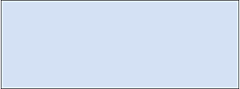

# myProject01
## I miai amici animali
Benvenuti nel **mio progetto** :relaxed:

nel quale vi descriverò i miei tre animali, precisamente

* un cane 
* un gatto
* un pappagallo

### Il cane
Perchè un cane? Sapete cosa si dice ...
> il cane è il migliore amico dell'uomo

nella mia casa non poteva dunque mancare.

Si chiama **Jack** ed è un inguaribile giocherellone.

### Il Gatto
Il mio felino si chiama Denise ed è molto dolce ma solo quando vuole ... :smirk:

Quando desidera le coccole si fa sentire con le fusa.

### Il pappagallo
Forse, è il più esigente, mangia solo quello che gli piace:

Cibo | Livello di Gradimento
------------ | -------------
Semi di girasole | li adora
Semi di zucca | ne è ghiotto
Semi di lino | sono troppo piccoli, se può li evita

### I miei hobby
I miei interessi principali sono

- [x] il calcio
- [x] la fotografia
- [x] la formula 1 
- [ ] forse, in futuro ne avrò altri

Infine :heart: molto [programmare](Programming.md)

Ritorna a farmi visita cliccando qui https://github.com/lucaliberti/myProject01/blob/main/README.md

### Riferimenti
Questo docimento è stato realizzato utilizzando
  1. [mastering-markdown](https://guides.github.com/features/mastering-markdown)
  1. [emoji-cheat-sheet](https://github.com/ikatyang/emoji-cheat-sheet/blob/master/README.md)
  1. [shield.io](https://shields.io/category/other)
  1. [freegifmaker](http://freegifmaker.me/images/2hDhA)
  1. [.diagrams.net](https://app.diagrams.net)

  

http://freegifmaker.me/images/2hDhA/

---

---

<ol> ciao
  <li> primo
  <li> secondo
</ol>

  

